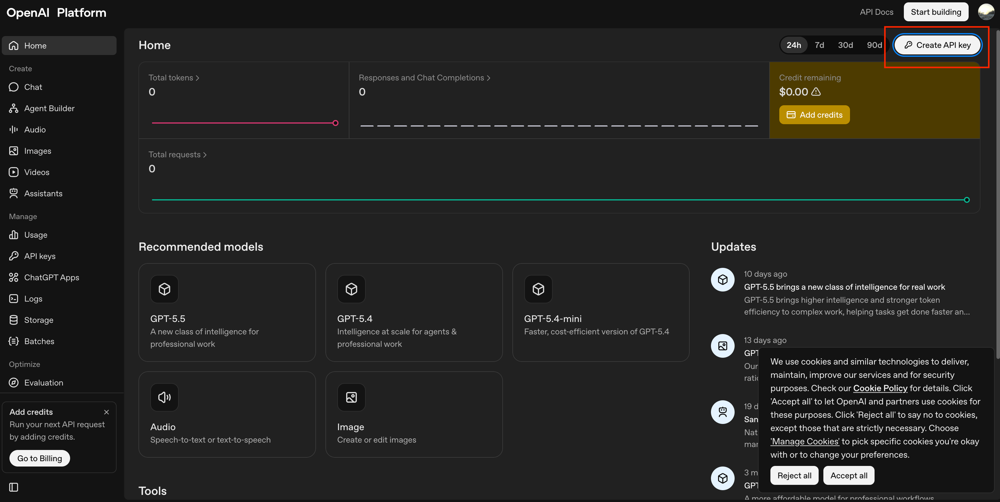
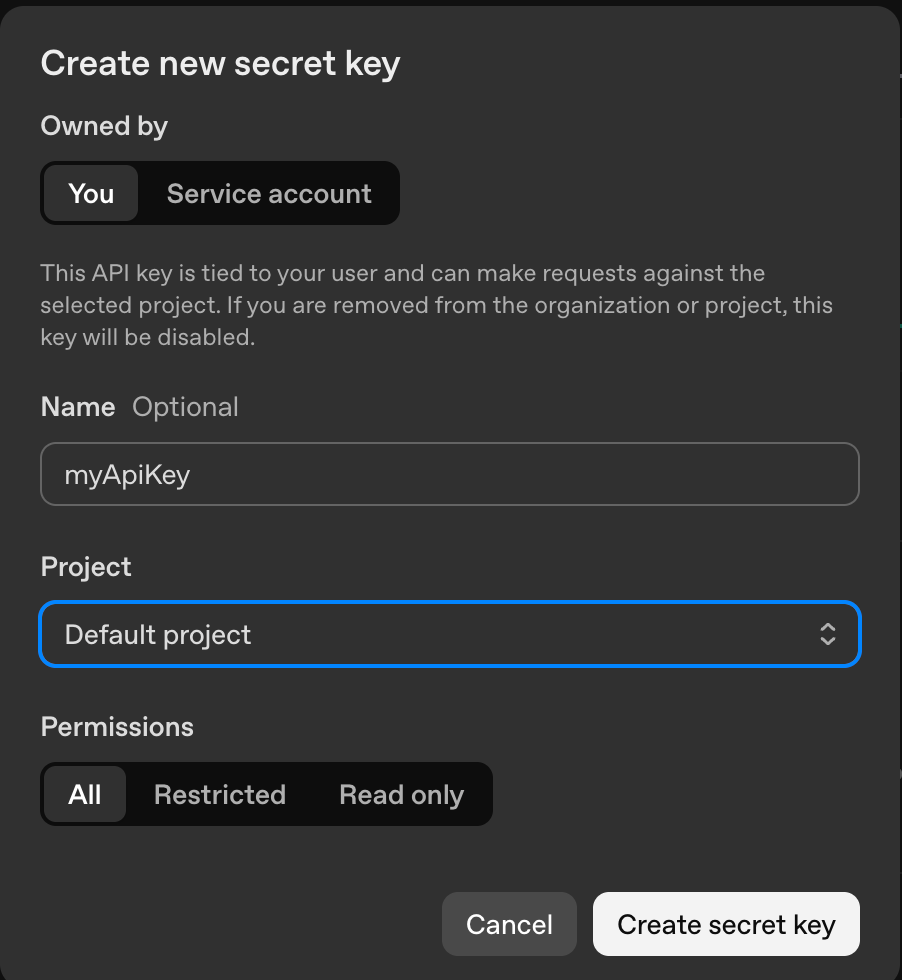
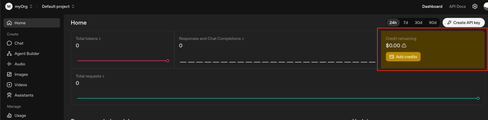
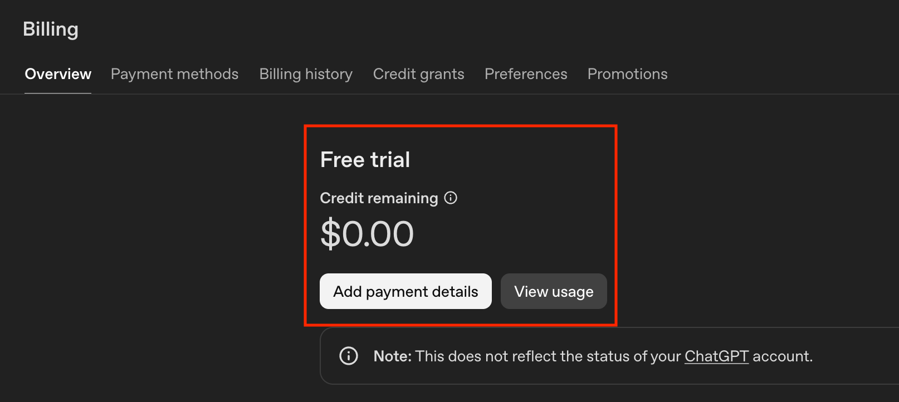

# This document has moved

The old "bring your own OpenAI API key" setup guide no longer applies. Urobi now calls OpenAI through the Urobi backend — no API key is required in the app.

Please see the new **[User Manual](user-manual.html)** for current setup and usage instructions.

---

*Archived content below (no longer applicable):*

Follow these steps to create an OpenAI account, generate an API key, and connect it to the Urobi app.

---

## Step 1: Create an OpenAI Account

Go to [https://platform.openai.com/](https://platform.openai.com/) and sign up for an account.

---

## Step 2: Generate an API Key

Once logged in, navigate to **API Keys** in your account settings and create a new secret key.

Copy the API key and paste it into the Urobi app under **Settings → OpenAI API Key**.

---

## Step 3: Set Up Billing

Go to the **Billing** section in your OpenAI account and set up a payment method.

---

## Step 4: Add Payment Details

Enter your payment details to enable API usage.

---

## Step 5: Add Credits

Load at least **$10.00** to your OpenAI account balance to start using the API.

---

Once completed, the Urobi app will be able to use OpenAI's AI features with your personal API key.